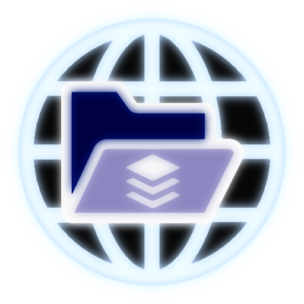

  
  </img>

# ByteNet

## Simple, buffer-based networking.

[GitHub](https://github.com/ffrostfall/ByteNet) | [Documentation](https://ffrostfall.github.io/ByteNet/)

ByteNet is an networking library which takes your Luau data, and serializes it into buffers. On the other end, ByteNet deserializes your data, and then feeds it back to your Luau code. You don't need to worry about type validation, optimization, packet structure, etc. ByteNet does all the hard parts for you! Strictly typed with an incredibly basic API that explains itself, ByteNet makes networking simple, easy, and quick. There's very few concepts you need to grasp in order to use ByteNet; it has an incredibly minimalistic & simplistic, yet powerful API.

## Installation

You can install ByteNet on Wally, or through the latest release's `.rbxm` file.

## Performance

ByteNet performs incredibly well compared to non-buffer based libraries like BridgeNet2. This is because ByteNet has a **custom serializer** that takes your Luau data and transforms it into a buffer, sending that and deserializing it on the other side.

## Further contact

You can contact me directly under the ByteNet thread in the [Roblox OSS Server](https://discord.gg/5KjV64PA3d).

Further documentation [here](https://ffrostfall.github.io/ByteNet/).

## License

This project is under the MIT license! so, it's open source
